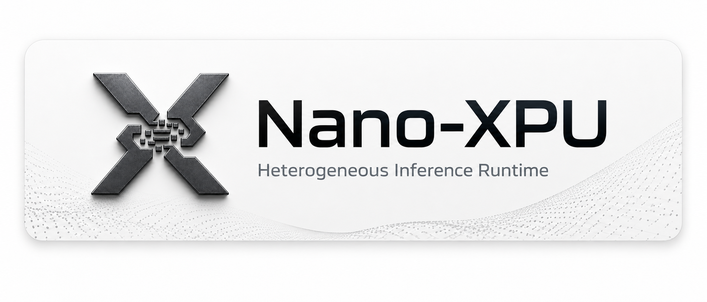

<p align="center">

</p>

# Nano-XPU

**A lightweight LLM inference runtime, evolving toward heterogeneous, stage-disaggregated serving.**

Nano-XPU is a lightweight LLM inference runtime forked from
[nano-vllm](https://github.com/GeeeekExplorer/nano-vllm). It keeps a compact,
readable codebase for fast offline inference **today**, and is evolving toward
**heterogeneous serving** — letting accelerators from different vendors and
hardware generations collaboratively serve one model through stage-disaggregated
architectures such as PD, EPD, and AFD.

> 🚧 Cross-vendor / cross-generation disaggregation (PD · EPD · AFD) is on the
> roadmap, not yet implemented. The current release ships the nano-vllm
> inference base. See [Roadmap](#roadmap).

## Key Features

Available today (inherited and extended from nano-vllm):

- 🚀 **Fast offline inference** — comparable inference speed to vLLM
- 📖 **Readable codebase** — clean implementation in ~1,200 lines of Python
- ⚡ **Optimization suite** — prefix caching, tensor parallelism, chunked
  prefill, torch compilation, and CUDA graph
- 🧱 **Plug-in model backends** — Qwen3 supported out of the box

## Installation

```bash
pip install git+https://github.com/yangjingo/nano-xpu.git
```

## Model Download

To download model weights manually:

```bash
huggingface-cli download --resume-download Qwen/Qwen3-0.6B \
  --local-dir ~/huggingface/Qwen3-0.6B/ \
  --local-dir-use-symlinks False
```

## Quick Start

See `example.py`. The API mirrors vLLM's interface with minor differences in
`LLM.generate`:

```python
from nanovllm import LLM, SamplingParams

llm = LLM("/YOUR/MODEL/PATH", enforce_eager=True, tensor_parallel_size=1)
sampling_params = SamplingParams(temperature=0.6, max_tokens=256)
prompts = ["Hello, Nano-XPU."]
outputs = llm.generate(prompts, sampling_params)
outputs[0]["text"]
```

## Benchmark

See `bench.py` for the benchmark script.

**Test Configuration:**
- Hardware: RTX 4070 Laptop (8GB)
- Model: Qwen3-0.6B
- Total Requests: 256 sequences
- Input Length: randomly sampled between 100–1024 tokens
- Output Length: randomly sampled between 100–1024 tokens

**Performance Results:**

| Inference Engine | Output Tokens | Time (s) | Throughput (tokens/s) |
|------------------|---------------|----------|-----------------------|
| vLLM             | 133,966       | 98.37    | 1361.84               |
| Nano-XPU         | 133,966       | 93.41    | 1434.13               |

## Roadmap

Nano-XPU is heading toward heterogeneous, stage-disaggregated serving. The
following directions are **planned** (not yet implemented) and welcome
contributions:

- **Cross-vendor acceleration** — coordinate NVIDIA GPUs, Ascend NPUs, and other
  AI accelerators within one inference pipeline.
- **Cross-generation resource reuse** — place each inference stage on the
  hardware generation best suited to its compute, memory, and bandwidth
  characteristics.
- **Stage-disaggregated serving** — Prefill–Decode (PD), Encode–Prefill–Decode
  (EPD), and Attention–FFN (AFD) disaggregation.
- **Unified data exchange** — standardize KV cache, multimodal embedding,
  activation, and routing-metadata exchange across heterogeneous backends.
- **Lightweight & hackable** — preserve nano-vllm's compact architecture for
  research, debugging, and rapid backend development.

For the full stage-by-stage plan — including the Ascend-first PD path
(A2 → A3 → cross-generation → cross-vendor) and the Week 1 milestones — see
**[docs/roadmap.md](docs/roadmap.md)**.

## Acknowledgements

Nano-XPU is built upon [nano-vllm](https://github.com/GeeeekExplorer/nano-vllm)
by [@GeeeekExplorer](https://github.com/GeeeekExplorer). Full credit for the
core inference engine goes to the nano-vllm project.

## Star History

[](https://www.star-history.com/#yangjingo/nano-xpu&Date)

## License

[MIT](LICENSE)
